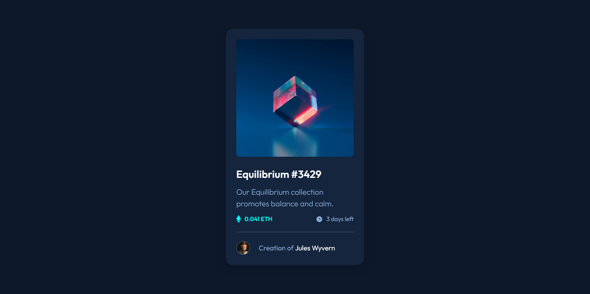

# Frontend Mentor - NFT preview card component solution

This is a solution to the [NFT preview card component challenge on Frontend Mentor](https://www.frontendmentor.io/challenges/nft-preview-card-component-SbdUL_w0U). Frontend Mentor challenges help you improve your coding skills by building realistic projects.

## Table of contents

- [Overview](#overview)
  - [The challenge](#the-challenge)
  - [Screenshot](#screenshot)
  - [Links](#links)
- [My process](#my-process)
  - [Built with](#built-with)
  - [What I learned](#what-i-learned)
- [Author](#author)

## Overview

### The challenge

Users should be able to:

- View the optimal layout depending on their device's screen size
- See hover states for interactive elements

### Screenshot

### Links

- Solution Repo: [Github Repo](https://github.com/Adel-Harrat/FM-NFT-preview-card-component)
- Live Site URL: [Live Demo](https://fm-nft-preview-card-component-red.vercel.app/)

## My process

### Built with

- Vite
- React
- TailwindCss
- Semantic HTML5

### What I learned

I learned how to add the image overlay when hover, using the group tailwind class that I never heard before ! xD

## Author

- Coder - Adel Harrat
- Frontend Mentor - [@Adel-Harrat](https://www.frontendmentor.io/profile/yourusername)
